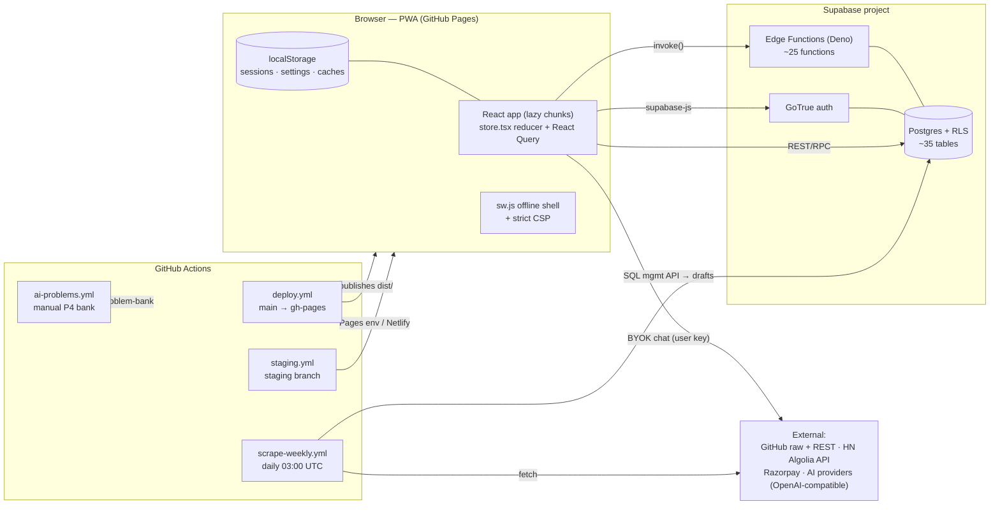

# InterviewIQ — Complete Architecture Design

_Version 1.1.0 · Generated 2026-09-16 from the codebase on `main` (`c4322b4`)._
_Companion docs: `docs/question-bank-expansion.md` (content pipeline), `docs/app-security.md` (security), `docs/skill-counselor.md` (career graph), `docs/ai-cost-optimization-plan.md`, `docs/resource-safety-guard.md`._

---

## 1. What InterviewIQ is

**InterviewIQ is an offline-first AI interview-prep PWA.** A user picks a level, field and company; the app composes a tailored mock-interview session, scores answers locally, gives feedback, and feeds results into a planner, roadmap, skill counselor, coding playground and job-application kit.

It runs with **no human content team**: content enters through a self-improving pipeline (scheduled scrapers → AI cleaning → admin review → publish), and the AI layer works both bring-your-own-key (BYOK, client-side) and via server-configured providers.

### Design principles (visible throughout the code)

| Principle | Where it shows |
|---|---|
| **Pure, dependency-free core** | `src/engine/*` and `scripts/*-lib.js` are side-effect-free and unit-tested; extraction/AI-contract logic never touches I/O |
| **Local-first data** | All user state lives in `localStorage` first (`services/storage.ts`); Supabase sync is an enhancement, never a requirement |
| **Draft-first content** | Nothing scraped is user-visible until an admin publishes it (`published_questions.published = false` + review inbox) |
| **Facts-only scraping + AI-original answers** | Extractors keep titles/topics/URLs (never verbatim bodies); answers are written fresh by AI; provenance columns (`source_id`, `source_url`, `meta`) on every row |
| **Admin-configurable, repo-fallback** | Sources/schedule/AI provider config live in Supabase (editable in the dashboard); repo files (`content/sources.json`) are only fallbacks |
| **Idempotent pipelines** | `ON CONFLICT (question) do nothing` upserts, rebuildable branches (`ai/problem-bank`), rerun-safe crons |
| **Offline as a feature** | Service-worker offline shell, cache-first assets, offline-shell check gates CI |

---

## 2. Tech stack

| Layer | Technology |
|---|---|
| UI | React 19, Tailwind CSS 4 (via `@tailwindcss/vite`), CodeMirror 6 (playground), i18next (i18n) |
| Build | Vite 6, TypeScript 5.7 (strict, `tsc --noEmit` gates build), manual vendor chunking |
| State | React Context + pure reducer (`src/store.tsx`), TanStack React Query 5, `CoachContext` |
| Async services | `@supabase/supabase-js` 2 (auth, Postgres, edge functions) |
| Backend | Supabase: Postgres (RLS), GoTrue auth, ~25 Deno edge functions, storage |
| AI | OpenAI-compatible chat APIs — BYOK (client) or server provider config (`ai_provider_config` + edge secrets) |
| Payments | Razorpay (checkout/verify/webhook/refund/tip edge functions) |
| Docs/PDF/OCR | pdf-lib, pdfjs-dist (worker), tesseract.js, docx generation |
| Tests | Vitest 2 (jsdom, 1,100+ tests), Deno test (edge functions), retrieval eval (`eval:rag`) |
| CI/CD | GitHub Actions: deploy (main → GitHub Pages), scrape-weekly (cron), ai-problems (manual P4), staging (Pages env + Netlify), offline-check |

---

## 3. High-level system diagram



---

## 4. Repository map

```
interviewiq/
├─ index.html                  # shell; CSP meta injected at build (vite.config.ts)
├─ public/                     # sw.js, manifest.webmanifest, 404.html, sitemap, icons
├─ src/
│  ├─ main.tsx                 # boot: theme → i18n → QueryClient → store → SW register → cloud/admin/teams init
│  ├─ store.tsx                # AppState context + pure reducer + hash routing (#/view)
│  ├─ types.ts                 # shared domain types (View, QA, Session, Answer, Config…)
│  ├─ engine/                  # PURE domain layer
│  │  ├─ compose.ts            #   composeSession / composeRelevantSession (session assembly)
│  │  ├─ scoring.ts            #   scoreAnswer + tokenize (local scoring)
│  │  ├─ feedback.ts           #   per-answer feedback
│  │  ├─ aggregate.ts          #   grade / aggregate / verdict / topicSuggestions
│  │  ├─ bank.ts               #   bankItems — unified view over static + published questions
│  │  └─ relevance/random/star #   relevance picking, shuffling, STAR evaluation
│  ├─ services/                # ~85 I/O-side modules (see §7)
│  │  ├─ admin/                #   dashboard backend access (access, questions, config, users, security…)
│  │  ├─ ai/  ·  runner/       #   AI provider/cache/validators · local code judge (new Function sandbox)
│  │  ├─ billing/ · content/ · jobs/ · roadmap/
│  │  └─ cloud, sync, remoteConfig, session, planner, rag, embeddings, resume*, voice, notifications…
│  ├─ components/              # 24 lazy-loaded views + ui primitives + admin/, jobs/, playground/, system-design/
│  ├─ data/                    # static banks shipped in the bundle
│  │  ├─ fields1/fields2, levels, companies, pools, deepDive, policies
│  │  ├─ codingBank/           #   human coding bank (reference solutions self-tested) + aiGenerated.ts (P4)
│  │  ├─ patterns.ts, starters.ts, systemDesignBank.ts, codingCompanies.ts
│  │  └─ skillCatalog.ts       #   career graph: fields → tracks → skills (bands), curated resources
│  ├─ contexts/, hooks/, i18n/ #   CoachContext, hooks, i18next resources
│  └─ __tests__/               # vitest suite (jsdom) — engine, services, components, eval:rag
├─ supabase/
│  ├─ *.sql                    # ~29 idempotent SQL files (schema + RLS + policies), see §8
│  ├─ functions/               # ~25 Deno edge functions + _shared/ (auth, cors, safeFetch, ratelimit…)
│  └─ migrations/              # dated migrations (e.g. tip payments)
├─ scripts/                    # Node pipelines (all dependency-free ESM)
│  ├─ scrape-sources.js + scrape-lib.js      # cron scraper + pure extractors
│  ├─ ai-clean.js + ai-clean-lib.js + ai-config.js  # AI cleaning of drafts
│  ├─ ai-draft-problems.js + ai-draft-lib.js # P4 AI problem drafting + local judge gate
│  ├─ gen-rag-corpus.mjs + seed-rag.mjs      # RAG corpus build + seeding
│  └─ setup-* · verify-secrets · gen-icons · deploy-functions · check-no-innerhtml · report-offline
├─ content/sources.json        # fallback scraper sources (dashboard is primary)
└─ .github/workflows/          # deploy · scrape-weekly · ai-problems · staging · staging-netlify · offline-check
```

---

## 5. Frontend architecture

### 5.1 Boot sequence (`main.tsx`)

1. `initTheme()` before first paint (no flash)
2. i18next provider (browser language detection + manual switcher)
3. React Query client (staleTime 30s, retry 1, no refetch-on-focus)
4. `AppProvider` (reducer store) → `App`
5. Production-only: register `sw.js` (offline shell; auto `SKIP_WAITING` + reload on update)
6. `initCloud()` → `initAdmin()` → `initTeams()` (all no-ops until Supabase is configured)

### 5.2 State management (`store.tsx`)

- **Single reducer store** (`AppState`): `view`, onboarding selection (`level/field/company` + optional pasted JD), `config` (count/mode/timing/voice), current `session`, `idx`, `answers`, `sessions` history.
- **Pure reducer** — side effects (persistence, notifications, progress, entitlements) live in the action-dispatch wrapper and services, keeping the reducer testable.
- **Persistence**: `storageGet/storageSet` over namespaced `STORAGE_KEYS` in localStorage (sessions, onboarding, settings).
- **Routing**: hash-based (`#/planner`), with a clean-path fallback (`/interviewiq/planner`) — chosen because GitHub Pages has no server rewrites. Back/forward handled via `hashchange`.
- **Server-state**: React Query for async fetches; `CoachContext` for the floating coach.

### 5.3 Views & code splitting

`components/App.tsx` lazy-loads **24 views** (Landing, Onboarding, Interview, Results, Planner, Roadmap, Drill, Bank, History, Progress, Settings, Account, Playground, Admin, Team, Jobs, Resources, Counselor, SkillExplorer, SkillDetail, SystemDesign, Articles, Legal, ShareView). The initial bundle ships only the shell (header, 5 primary tabs, ☰ menu with 11 secondary destinations, FloatingCoach, ToastHost). Nav gates behind `remoteConfig` feature flags (`featureOn`, `menuVisible`).

### 5.4 PWA & offline

- `public/sw.js`: cache-first offline shell; the app serves the same `index.html` offline; SW update messages trigger graceful reload.
- `public/manifest.webmanifest` + install prompt (`beforeinstallprompt`).
- CI runs `report-offline` (offline-shell check) so a broken offline build cannot ship.
- Strict **CSP meta tag injected into the built index.html only** (dev keeps none for HMR): `script-src 'self' 'unsafe-eval'` is required by the in-browser code judge; Razorpay origins allowlisted; `worker-src blob:` for pdfjs.

### 5.5 i18n & UX infra

i18next + language detector + `LanguageSwitcher`; `ErrorBoundary`, `PerformanceMonitor`, `extensionGuard` (detects extensions that hijack module imports), toast system, undo stack, online/offline indicator.

---

## 6. Domain engine (pure core)

`src/engine` is the deterministic heart — no I/O, fully unit-tested:

| Module | Responsibility |
|---|---|
| `compose.ts` | `composeSession` / `composeRelevantSession` — assemble a session from static bank + published questions, respecting level/field/company/mode/timing |
| `scoring.ts` | `scoreAnswer` + tokenization — local answer scoring without any AI call |
| `feedback.ts` | `buildFeedback` — per-answer feedback (strengths, gaps, STAR prompts) |
| `aggregate.ts` | `grade`/`aggregate`/`verdict`/`topicSuggestions` — session → results view |
| `bank.ts` | `bankItems` — one `BankItem[]` view merging static data banks with Supabase `published_questions` (deduped by question text) |
| `relevance.ts`, `random.ts`, `star.ts` | relevance-ranked question picking; deterministic shuffling; STAR evaluation |

`src/services/session.ts` builds the concrete session flavors (practice, JD-tailored, replay, weak-topic, diagnostic) on top of the engine.

---

## 7. Services layer (~85 modules)

| Group | Modules | Role |
|---|---|---|
| **AI** | `aiProvider`, `aiModels`, `aiCache`, `aiOutputNormalizer`, `aiQualityValidator`, `aiProviderHistory`, `moduleModels`, `modelCapabilities`, `secrets`, `edgeSecrets` | BYOK chat (any https base), server provider config fallback, response caching, strict-JSON output normalization, quality validation, per-module model selection |
| **Coach/RAG** | `rag`, `embeddings`, `tutor`, `systemDesignTutor`, `deepDive` (data), `articleNormalizer` | Retrieval-augmented coach over embedded corpus + uploaded PDFs (pdf_documents/pdf_chunks) |
| **Content** | `contentService`, `contentScraper`, `contentCuration`, `contentQuality`, `contentRefiner`, `questionBank`, `duplicates`, `cleaner` | In-app content tooling feeding the same draft/review pipeline as the cron scrapers |
| **Coding** | `runner/` (`core`, `fnJudge`, `uiJudge`), `codingTrack` | Local judge: user/AI code runs in a sandboxed `new Function` with line-oriented stdout comparison; UI-judge variant for DOM exercises |
| **Admin** | `admin/` (`access`, `state`, `config`, `questions`, `users`, `announcements`, `pdfDocs`, `ragSeed`, `security`) | Dashboard backend access — all reads/writes go through RLS-protected tables; admin identity from `app_admins` |
| **Cloud & sync** | `cloud`, `sync`, `profileStore`, `storage`, `teams` | Supabase auth + row sync layered over localStorage; team workspaces |
| **Growth/ops** | `planner`, `studyPlan`, `gapPlan`, `drill`, `progress`, `roadmap/`, `skillCounselor`, `skillRoadmapService`, `skillsReport`, `xp`, `completion`, `certificates`, `leaderboard`, `trendSignals`, `notifications`, `events`, `feedback` | Practice planning, roadmaps, gamification, digests |
| **Jobs & apply** | `jobs/feed`, `applyTrack`, `jd`, `resume*` (parser/pdf/docx/HTML), `atsPreview`, `import`, `importJob`, `salaryBench` | Job feed consumption, JD tailoring, resume build/parse/OCR |
| **Billing** | `billing/`, `entitlements`, `entitlement` | Server-verified Pro (Razorpay edge functions → `payments`/`entitlements`), grant codes, admin billing actions |
| **Platform** | `remoteConfig`, `siteConfig`, `config`, `env`, `theme`, `voice`, `zip`, `pdf`, `uint8Polyfill`, `undoStack`, `extensionGuard`, `triageWorker`, `policies`, `license`, `recoveryCodes` | Feature flags/announcements (app_config), PWA support utilities |

---

## 8. Backend architecture (Supabase)

### 8.1 Postgres schema (idempotent SQL files, run top-to-bottom)

| Domain | Tables |
|---|---|
| Core | `profiles`, `user_sync`, `app_config`, `announcements`, `usage_events` |
| Question bank | `published_questions` (+ `published`, `source_id`, `source_url`, `meta jsonb`, `created_at`), `question_audit`, `question_feedback` |
| Scraping config | `scraper_sources` (+ `config jsonb` extractor options), `scraper_config` (schedule days) |
| RAG / documents | `pdf_documents`, `pdf_chunks` (+ `rag.sql` embeddings tables) |
| Admin & security | `app_admins`, `admin_audit`, `edge_secrets`, `recovery_codes`, `recovery_attempts`, `recovery_backup_requests` |
| Teams | `teams`, `team_members`, `team_audit` |
| Billing | `entitlements`, `grant_codes`, `subscriptions`, `coupons`, `payments`, `billing_actions`, `tip_payments` |
| Jobs | `career_profiles`, `uploaded_resumes`, `jobs`, `jobs_fetch_reports` |
| Community/resources | `resources`, `resource_votes`, `skill_signals`, `update_proposals`, `leaderboard` |
| AI governance | `ai_provider_config`, `ai-user-quotas`, `ai-cost-controls`, `content_curation`, `skill_roadmaps` |

**RLS model** (see `supabase/security.sql`, `admin.sql`): user-owned rows keyed by `auth.uid()`; admin surface gated by `app_admins` membership via an `is_admin()` helper; service-role access reserved for edge functions and the GitHub pipelines (management API).

### 8.2 Edge functions (Deno, ~25)

| Group | Functions |
|---|---|
| AI/RAG | `ai-chat`, `embed`, `seed-rag`, `content-index`, `content-scrape` |
| Jobs/digests | `jobs-fetch`, `send-apply-digest`, `send-recommendations-digest`, `send-security-digest`, `send-rag-digest` |
| Payments | `pay-checkout`, `pay-verify`, `pay-webhook`, `pay-refund`, `pay-tip`, `pay-cancel` |
| Content/community | `article-fetch`, `submit-resource`, `revalidate-resources`, `import-job`, `trends-refresh` |
| Account/security | `mfa-recovery`, `recovery-backup`, `secret-status`, `test-email` |

`functions/_shared/` provides the reusable backend kernel: `auth`, `cors`, `safeFetch` (SSRF-guarded fetch), `ratelimit`, `resourceGuard` (resource-safety policy), `secrets`, `serviceClient`, `embedProvider`, `ragSeed`, `email`, `payment`, `trends`, `rss`, `salary`, `reputation`, `articleExtract`, `importPage`, `dates` — each with its own Deno unit tests that run in the deploy pipeline.

### 8.3 Scheduled backend work

SQL cron entries (`jobs-fetch-cron.sql`, `revalidate-resources-cron.sql`, `send-*-digest-cron.sql`, `trends-refresh-cron.sql`) invoke the corresponding edge functions on schedule.

---

## 9. Content pipeline (the "self-improving" loop)

```mermaid
flowchart LR
  A["scraper_sources\n(admin-editable) +\ncontent/sources.json fallback"] --> B["scrape-weekly.yml\n(cron 03:00 UTC;\nschedule from scraper_config)"]
  B --> C["scripts/scrape-sources.js\npolite fetch + 429 backoff"]
  C --> D["scrape-lib.js extractItems\njson · markdown · html ·\ncompany-list · hackernews"]
  D --> E["dedupe by question text\n→ buildUpsertSql\nON CONFLICT do nothing"]
  E --> F[("published_questions\npublished=false\n+ source_id/source_url/meta")]
  F --> G["ai-clean.js\nAI-original answers,\nstrict-JSON contract"]
  G --> H["Admin → Review inbox\n(human gate)"]
  H -->|publish| I[("published_questions\npublished=true")]
  I --> J["remoteConfig.publishedFor()\n→ engine/bankItems\n→ Bank · Interview · Drill"]
```



Key mechanics:

- **Extraction is pure** (`scrape-lib.js`): five extractors picked by `source.type`; per-source options (`headingDepth`, `questionFromHeading`, `headingPrefix`, `groupAs`) ride in `scraper_sources.config`.
- **Legal posture**: only `raw.githubusercontent.com` + official public APIs (HN Algolia); titles/topics/URLs are kept as *facts*, bodies never copied verbatim; AI writes original answers; every draft carries provenance.
- **Admin-first config**: the dashboard writes `scraper_sources`/`scraper_config`; `content/sources.json` is the zero-config fallback.
- **Planned extension** (design approved — `docs/auto-discovery-ingestion-plan.md`): auto-discovery crawler ("paste a URL → discover inner links → normalize → route") with attribution capture and a takedown/rollback system (suppression list + soft/hard purge + audit trail).

---

## 10. Coding-problem pipeline

Two banks coexist:

1. **Human bank** (`src/data/codingBank/`): curated problems, each shipping a `reference` solution; `src/__tests__/algorithms.test.ts` runs every reference against its own visible + hidden cases — the bank self-tests at CI time.
2. **AI bank (P4)** — `ai-problems.yml` (manual dispatch):
   - Harvest problem **titles** + company/difficulty metadata from public mirrors (`ai-draft-lib.buildCandidates`, Easy/Medium-only option).
   - AI drafts an **original** prompt/I-O contract/tests/reference per title (strict JSON, `function solve(lines)` skeleton).
   - Each draft is **gated through the local judge** (`runJudge` via `node:vm`, 3s timeout, stdout normalization identical to the app runner) — only self-passing problems survive.
   - Survivors are emitted to `src/data/codingBank/aiGenerated.ts` on the `ai/problem-bank` branch (branch rebuilt atop main each run; accumulated file carried over) and opened/updated as a **review PR** — the owner's merge is the human gate.
   - In-app execution uses the same contract (`services/runner/fnJudge` — sandboxed `new Function`, line-oriented stdout).

---

## 11. Coach & RAG

- **Corpus**: `scripts/gen-rag-corpus.mjs` builds the corpus from curated sources; `seed-rag` edge function embeds and stores it (`pdf_chunks`/rag tables) via `embedProvider` (provider-agnostic embeddings).
- **User documents**: resume/PDF uploads → `pdf_documents` + chunked `pdf_chunks` (pdfjs in a worker; tesseract.js OCR fallback).
- **Retrieval**: `services/rag` + `embeddings` serve the FloatingCoach and tutor services; `CitationChip`/`GroundingNote` surface sources in answers.
- **Quality gate**: `npm run eval:rag` (`rag-eval.test.ts`) runs retrieval regressions in every deploy — a bad embedding/corpus change cannot ship.

---

## 12. Jobs, trends, resources, digests

| Feature | Flow |
|---|---|
| **Jobs** | `jobs-fetch` edge function + cron → `jobs` table (+ `jobs_fetch_reports` run reports) → `Jobs` view; `applyTrack` manages the application pipeline; `send-apply-digest` emails digests |
| **Trends** | `usage_events`/`skill_signals` → `trends-refresh` cron → `update_proposals` for admins |
| **Resources** | Community-submitted via `submit-resource` (guarded by `_shared/resourceGuard` + `safeFetch`) → votes → `revalidate-resources` cron checks link health |
| **Digests** | `send-*-digest` functions email recommendations/security summaries |

---

## 13. Billing & entitlements

Razorpay end-to-end: `pay-checkout` (order) → client Razorpay Checkout (CSP-allowlisted) → `pay-verify`/`pay-webhook` (server-verified) → `payments`/`subscriptions`/`entitlements` tables → client `refreshEntitlement()` re-checks on sign-in/sync changes (grants/revokes apply without redeploy). Grant codes + coupons + admin billing actions (`billing_actions` audit) round it out; tips via `pay-tip` → `tip_payments`.

---

## 14. Admin dashboard

In-app `Admin` view (`components/admin/*`) — surfaced only for `app_admins` members, all data through RLS:

- **Questions**: review inbox (drafts → publish/reject), audit, feedback triage
- **Sources**: scraper sources CRUD + schedule (`scraper_config.days`), run visibility
- **AI pipeline**: provider config (`ai_provider_config`), secrets (`edge_secrets`), quotas/cost controls
- **Users & billing**: users, entitlements, grant codes, payments
- **Content ops**: announcements, `app_config` flags, resources curation, skill-roadmap editor (`AdminSkillRoadmaps`), RAG seeding, PDF knowledge docs

---

## 15. CI/CD & environments

| Workflow | Trigger | What it does |
|---|---|---|
| `deploy.yml` | push to `main` + manual dispatch | npm audit gate → eval:rag → typecheck → build (tsc + no-innerHTML check + vite) → full vitest → Deno edge tests → offline-shell check → push `dist/` to `gh-pages` → deploy edge functions to Supabase |
| `scrape-weekly.yml` | cron daily 03:00 UTC | scrape sources → drafts (Supabase management API); optional AI-clean step; admin-configured schedule decides the actual day |
| `ai-problems.yml` | manual dispatch | P4 AI problem drafting → judge gate → `ai/problem-bank` branch → review PR |
| `staging.yml` / `staging-netlify.yml` | push to `staging` | staging build (`.env.staging`) → GitHub Pages *environment* / Netlify |
| `offline-check.yml` | PR/push | standalone offline-shell verification |

**Environments**: production = GitHub Pages at `https://gaurav123337.github.io/interviewiq/` (from `gh-pages`); staging = Pages environment + Netlify; shared Supabase project, configured via secrets (`SUPABASE_ACCESS_TOKEN`, `SUPABASE_PROJECT_REF`) and the management API. Actions are pinned by commit SHA; dependency bumps flow through PRs (#50/#51 pattern).

---

## 16. Security model (summary — details in `docs/app-security.md`)

1. **CSP at build** (vite plugin, §5.4) — travels with the offline shell.
2. **No raw HTML injection**: `scripts/check-no-innerhtml.mjs` fails the build on `innerHTML`/`dangerouslySetInnerHTML` (tiny allowlist where unavoidable).
3. **RLS everywhere**; admin via `app_admins` + `is_admin()`; service role only server-side.
4. **SSRF guard** (`_shared/safeFetch`), **rate limiting** (`_shared/ratelimit`), **resource-safety guard** for user-submitted links.
5. **Edge secrets** stored server-side (`edge_secrets`), never bundled; AI BYOK keys stay client-local by design.
6. **Payment verification server-side** (webhook + verify); entitlements never trust the client.
7. Account recovery via recovery codes + backup requests with audit rows; admin/team actions audited (`admin_audit`, `team_audit`, `question_audit`).

---

## 17. Testing strategy

| Suite | Where | Notes |
|---|---|---|
| Vitest (jsdom) | `src/__tests__/` (100+ files, 1,100+ tests) | engine (pure), services (fake-client harnesses), components, pipelines (`scrape.test.ts`, `aidraft.test.ts`), bank self-test (`algorithms.test.ts`), 30s timeout cap |
| Retrieval eval | `src/__tests__/rag-eval.test.ts` | `npm run eval:rag` — CI gate for coach quality |
| Deno tests | `supabase/functions/_shared/*.test.ts` | run in the deploy pipeline for the edge kernel |
| Build gates | `tsc --noEmit` + `check-no-innerhtml` + offline-shell report | all inside `npm run build` / deploy |

---

## 18. Cross-cutting conventions

- **Dependency-free scripts**: every pipeline lib is plain ESM with zero npm deps — importable from vitest and the browser where useful.
- **Header-comment documentation**: each module opens with a comment stating its contract; cross-references cite docs (§ style).
- **Provenance meta**: `meta jsonb` rides on every content row (URL, company, difficulty, discovery data) — attribution and future takedown work build on it.
- **Tolerant reads**: config loaders fall back (dashboard → repo file), missing tables degrade to empty results — pipelines never hard-crash on partial setup.
- **Chunked, idempotent SQL writes** from all pipelines; `create table if not exists` / `add column if not exists` everywhere.

---

## 19. Extension points (designed, not yet built)

1. **Auto-discovery ingestion engine** — classify any seed URL (GitHub topic/repo/HTML/sitemap), BFS-crawl within budgets (maxDepth/maxPages), route yield to Q&A drafts / problem titles / resources, with a pluggable fetcher seam (Playwright later), per-item attribution, and a **takedown & rollback system** (suppression list, soft→hard purge, audit trail). Full plan: `docs/auto-discovery-ingestion-plan.md`.
2. **Scraper run reporting** (`scraper_runs`) for admin dashboard run history.
3. Question-bank metadata (added-on timestamps) and live/draft/skill filters (Phase 4 items 1–2).
